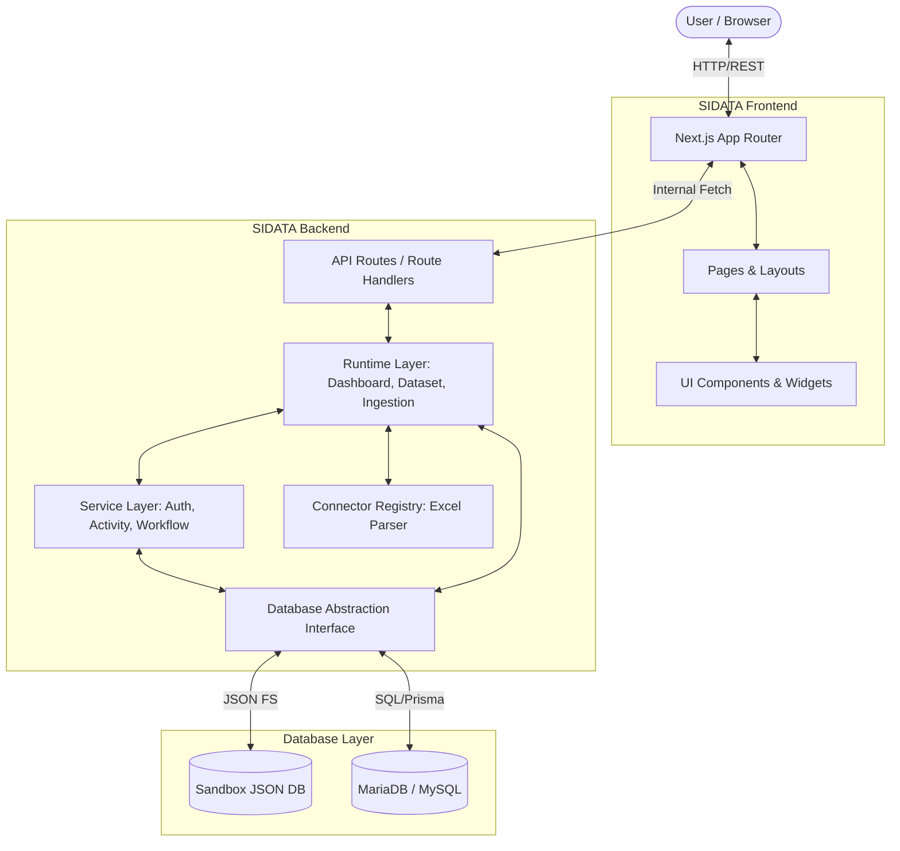
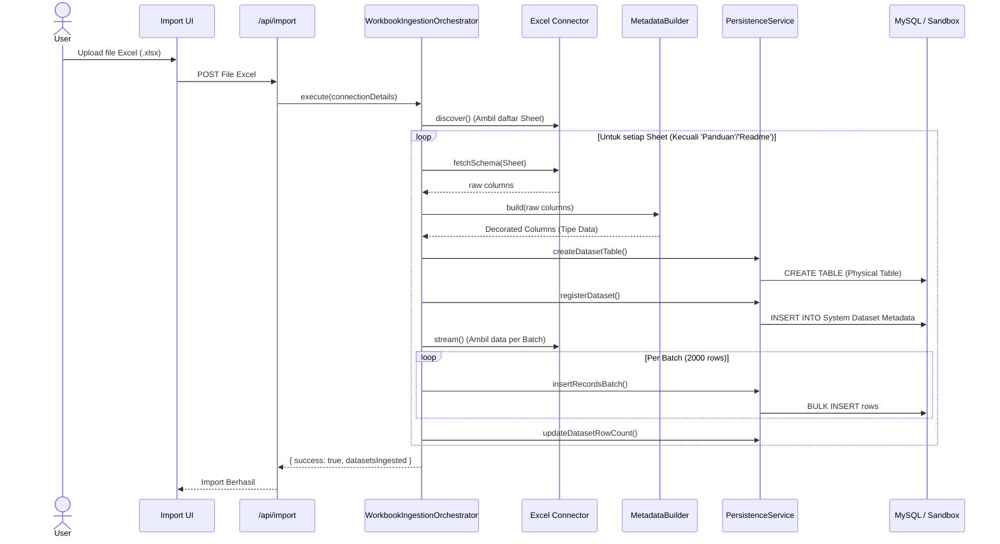
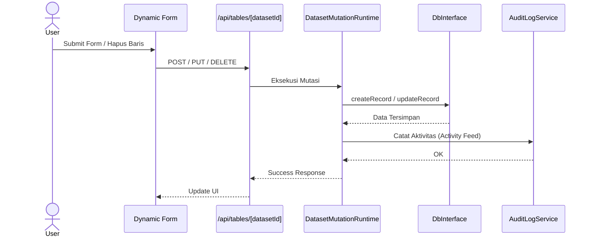
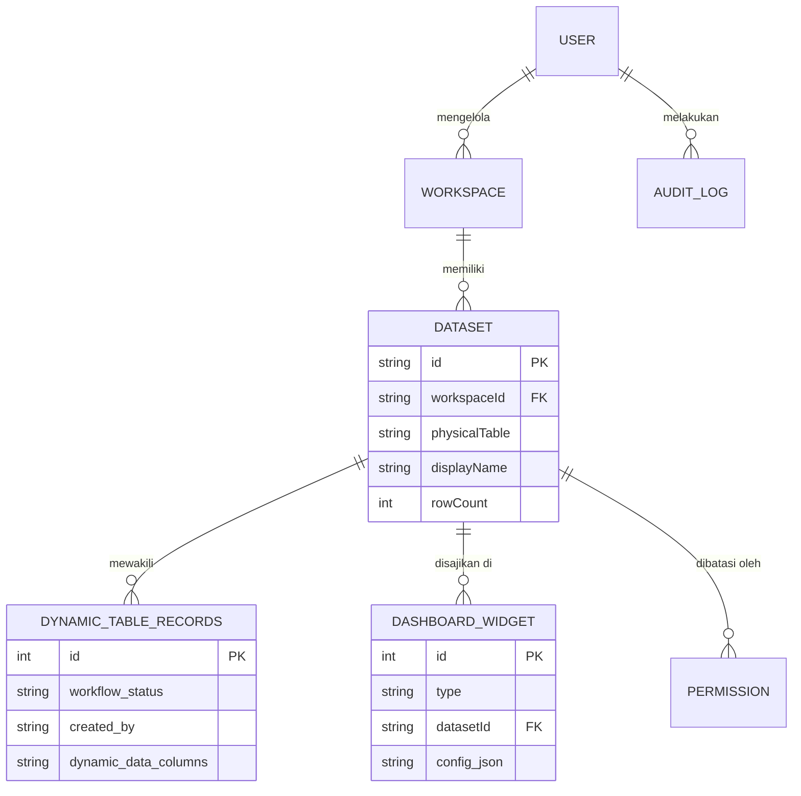

# SIDATA Technical Architecture

## 1. Overview

Dokumen ini menjelaskan arsitektur teknis dari aplikasi SIDATA. Penjelasan mencakup teknologi yang digunakan, alur sistem, integrasi data dari Excel ke Database, serta mekanisme implementasi dinamis untuk tabel, form (CRUD), dan dashboard. Dokumentasi ini dibuat berdasarkan hasil audit langsung pada *source code* aplikasi dan bertujuan memfasilitasi *knowledge transfer*, laporan, dan pengembangan lanjutan.

---

## 2. Technology Stack

Berdasarkan audit repositori SIDATA, aplikasi ini menggunakan *stack* teknologi modern berbasis Node.js dengan rincian sebagai berikut:

### 2.1 Frontend

| Teknologi | Versi | Digunakan untuk | Lokasi Implementasi |
| :--- | :--- | :--- | :--- |
| **Next.js** | 16.2.9 | Framework aplikasi utama (App Router) | Keseluruhan `src/app` |
| **React** | 19.2.4 | Library rendering UI & State | Komponen UI |
| **TypeScript** | 5.x | *Type safety* dan struktur bahasa | Keseluruhan repositori |
| **Tailwind CSS** | 4.x | *Styling utility* | `postcss.config.mjs`, UI |
| **Lucide React** | 1.21.0 | Ikon UI | Komponen UI |
| **Recharts** | 3.8.1 | Rendering grafik dan visualisasi dashboard | Dashboard Widgets |
| **TanStack Virtual** | 3.14.5 | Virtualisasi tabel untuk performa data besar | Tabel *Dynamic Dataset* |
| **Next Themes** | 0.4.6 | Manajemen tema (Light/Dark mode) | `src/app/layout.tsx` |

### 2.2 Backend

| Teknologi | Digunakan untuk | Lokasi Implementasi |
| :--- | :--- | :--- |
| **Next.js API Routes** | Endpoint REST API bawaan dari Next.js. Frontend dan backend digabungkan dalam satu repositori *(monorepo-style)*. | `src/app/api/` |
| **Service Layer Pattern** | Logika bisnis untuk notifikasi, aktivitas, workflow, dan autentikasi. | `src/services/` |
| **Runtime Layer Pattern** | Eksekusi dinamis untuk Dashboard, Dataset, dan Mutasi Data. | `src/runtime/` |
| **Connector Engine** | Standarisasi input eksternal (seperti Excel). | `src/connectors/` |

### 2.3 Database

SIDATA mendukung **Dual-Database Mode** yang diabstraksikan melalui antarmuka `DbInterface`.

| Teknologi | Digunakan untuk | Keterangan |
| :--- | :--- | :--- |
| **Prisma ORM** | Skema database dan *type-safe query builder* (v7.8.0). | `prisma/` & `@prisma/client` |
| **MariaDB / MySQL** | Database relasional utama untuk produksi (`mysql2`, `@prisma/adapter-mariadb`). | `src/db/index.ts` |
| **Sandbox DB (JSON)** | Database mock berbasi file lokal (`sandbox_db.json`) untuk pengembangan cepat tanpa setup DB SQL. | `src/db/index.ts` (`readSandbox()`) |

### 2.4 Supporting Libraries

- **XLSX & PapaParse**: Digunakan untuk pembacaan dan *parsing* file Excel/CSV di sisi server saat proses import.

---

## 3. System Architecture

Aplikasi ini menggunakan pola arsitektur **Layered Abstraction**. Frontend dan backend berjalan dalam ekosistem Next.js.

### Diagram Arsitektur Sistem (Versi Teknis)



**Tanggung Jawab Setiap Layer:**
1. **Presentation Layer (`src/app/`, `src/components/`)**: Mengelola UI, routing, dan *state* interaksi pengguna.
2. **API Layer (`src/app/api/`)**: Menjembatani request HTTP dari frontend, validasi parameter, dan otorisasi endpoint.
3. **Runtime / Business Logic Layer (`src/runtime/`, `src/services/`)**: Menangani proses inti seperti orkestrasi import excel (`WorkbookIngestionOrchestrator`), logika agregasi dataset (`QueryEngine`), dan layanan bisnis (`WorkflowEngine`).
4. **Data Access Layer (`src/db/index.ts`)**: Menerapkan *Repository pattern* melalui `DbInterface`, menyembunyikan kompleksitas query, dan secara dinamis menyisipkan kolom kolaborasi (`owner_username`, `created_at`, dsb.).
5. **Database Layer**: Penyimpanan fisik (baik MariaDB produksi maupun Sandbox JSON).

---

## 4. Application Workflow

### Alur Kerja Umum (Versi Sederhana)
Bayangkan Anda menggunakan SIDATA seperti masuk ke perpustakaan pintar.
1. Anda menunjukkan kartu identitas di pintu masuk (Login & Middleware).
2. Anda meminta buku data ke pustakawan (Frontend meminta ke API).
3. Pustakawan pintar (Runtime Layer) mencari tahu buku mana yang Anda miliki aksesnya.
4. Ia mengambilnya dari gudang arsip utama (Database/MySQL).
5. Pustakawan merangkum datanya dan memberikannya ke Anda (API mengirim JSON ke Frontend yang lalu merendernya menjadi grafik/tabel).

### Contoh Flow: User Membuka Halaman Data Pemantauan
1. **User** membuka aplikasi melalui URL `/data-pemantauan`.
2. **Middleware (`src/middleware.ts`)** memeriksa ketersediaan *session token*. Jika valid, dilanjutkan.
3. **Frontend** merender kerangka halaman dan melakukan *fetch* ke `/api/datasets`.
4. **API Route** menerima request dan meneruskannya ke `DatasetRuntime`.
5. **DatasetRuntime** memeriksa izin pengguna dan membangun kriteria pencarian (*QueryEngine*).
6. **DbInterface** di layer data menerjemahkan kriteria pencarian ke *SQL Query* (atau pencarian Sandbox) dan memanggil database (misal: MariaDB).
7. **Database** merespons dengan baris data.
8. **API Route** mengembalikan data dalam format JSON.
9. **Frontend (TanStack Virtual Table)** menerima JSON dan merender tabel interaktif di browser.

---

## 5. Excel to MySQL Data Flow

Proses integrasi dari Excel menuju database secara otomatis ditangani oleh backend SIDATA menggunakan mekanisme `WorkbookIngestionOrchestrator`. Tidak ada penggunaan script eksternal seperti Python, semua murni menggunakan TypeScript (`xlsx`).

### Arsitektur Import Data



**Penjelasan Tahapan:**
1. **Upload Excel**: File diterima oleh endpoint API.
2. **Pembacaan Data (`src/connectors/excel/`)**: Connector mengekstrak nama *sheet*. Sheet panduan/informasi akan otomatis diabaikan. Header dibaca dari baris pertama.
3. **Pembersihan & Mapping (`MetadataBuilder.ts`)**: Tipe data disimpulkan (string, angka, tanggal, boolean). Kolom di-*mapping* untuk menjadi struktur tabel fisik.
4. **Penyimpanan ke Database (`PersistenceService.ts`)**: 
   - Transaksi database dimulai.
   - Tabel fisik dinamis dibuat (`createDynamicTable`).
   - Meta data (*dataset id, workspace*) didaftarkan ke registri sistem.
   - Data Excel dibaca secara *streaming* dan di-*insert* menggunakan *batching* (mencegah *memory leak* untuk file Excel besar).

---

## 6. Metadata-Driven Dataset Architecture

Konsep *Dynamic Dataset* di SIDATA mengizinkan pembuatan halaman tabel secara "ajaib" tanpa *programmer* perlu membuat *coding* UI React baru untuk setiap Excel yang diunggah.

### Cara Kerja:
- **Logical Dataset vs Physical Table**: Saat Excel diunggah, SIDATA menyimpan definisinya di tabel metadata sistem (Logical). Kemudian SIDATA membuat tabel sungguhan berdasar nama sheet tersebut (Physical Table).
- **Kolom Dinamis**: Saat pengguna masuk ke `/workbooks/[workspaceId]/[datasetId]`, halaman (*wildcard page*) memanggil `DatasetRuntime` untuk membaca metadata (struktur kolom) terlebih dahulu.
- **Render Otomatis**: Frontend memanfaatkan metadata tersebut untuk membuat *header* tabel, menentukan tipe filter (teks atau angka), dan menyusun form input secara spontan.
- **Sistem Kolaborasi**: Setiap tabel otomatis disuntikkan kolom metadata tersembunyi (`owner_username`, `created_at`, `workflow_status`) menggunakan `ensureCollaborationColumns()` di level database untuk pelacakan dan keamanan (RLS).

---

## 7. Dynamic CRUD Architecture

Operasi Tambah, Edit, Hapus (CRUD) dilakukan secara terpusat tanpa membuat endpoint baru per dataset.



---

## 8. Dynamic Dashboard Architecture

Alih-alih meng-_hardcode_ grafik satu per satu, dasbor SIDATA bersifat meta-data driven.

### Cara Kerja:
1. **Dashboard Widget Registry**: Konfigurasi tipe widget (Total Data, Pie Chart, Bar Chart) tersimpan di tabel `dashboardWidgets` yang berasosiasi dengan metadata dataset.
2. **DashboardRuntime**: Mengorkestrasi pengambilan konfigurasi dasbor lalu mendelegasikan perintah ke `QueryEngine`.
3. **QueryEngine Aggregate**: Melakukan agregasi (menjumlahkan *count*, menghitung rata-rata, mengelompokkan unit kerja) langsung di sisi backend/database (`aggregateDataset()` atau `getTableAnalytics()`).
4. **WidgetRenderer**: Frontend menerima payload ringkas berupa angka atau array agregasi yang langsung di-*plug-in* ke *Recharts* / *KPI Card* tanpa proses berat di peramban pengguna.

Mengapa agregasi di backend? Ini menjaga kecepatan render browser tetap tinggi, mengamankan privasi baris data (RLS/Row-Level Security), dan mencegah beban pengiriman puluhan megabyte data hanya untuk sebuah grafik pie.

---

## 9. Security Architecture

SIDATA menerapkan *Defense in Depth* mulai dari URL hingga tingkat baris data.

### Implementasi:
- **Authentication**: Berbasis *cookie* `session_token`. Diintersep oleh `middleware.ts`.
- **Role-based access (RBAC)**: Tersedia konsep `owner`, `admin`, `viewer` dalam manajemen pengguna, dibantu oleh tabel `accessRequests`.
- **Row-Level Security (RLS) & Column-Level Security (CLS)**: (Telah direncanakan / _Partially Implemented_) Menggunakan tabel `permissions` yang menyimpan aksi yang boleh dilakukan, kolom yang di-*mask*, dan aturan filter per baris.

### Simulasi Sederhana Pengguna:
- **Viewer**: Membuka halaman. DatasetRuntime membatasi QueryEngine hanya untuk membaca (_SELECT_). Aksi mutasi di tombol UI disembunyikan.
- **Editor**: Dapat menambah data. Kolom kolaborator (`updated_by`) secara otomatis diisi oleh sistem untuk mendeteksi siapa pengubah data.
- **Admin**: Memiliki kendali penuh di tabel `workspaces` dan konfigurasi hak akses (`permissions`).

---

## 10. Database Architecture (Logical ERD)

Keterangan: _Karena SIDATA bersifat Metadata-driven dan mendukung sistem Sandbox JSON dinamis, relasi ini merupakan Logical ERD atas arsitektur internal SIDATA._



---

## 11. Folder Structure

Tinjauan struktur utama aplikasi:
```text
📦 SIDATA
 ┣ 📂 src
 ┃ ┣ 📂 app               (Next.js App Router, UI, API Routes)
 ┃ ┣ 📂 components        (Komponen React Reusable, UI Library)
 ┃ ┣ 📂 connectors        (Abstraksi parser file, contoh: excel)
 ┃ ┣ 📂 db                (Koneksi Database, Prisma, Sandbox DB Abstraction)
 ┃ ┣ 📂 lib               (Fungsi utilitas, konfigurasi)
 ┃ ┣ 📂 runtime           (Logika eksekusi dinamis Dataset & Dashboard)
 ┃ ┗ 📂 services          (Manajemen bisnis spesifik: Activity, Workflow, Notifikasi)
 ┣ 📜 package.json        (Konfigurasi NPM, Dependencies)
 ┣ 📜 prisma/schema.prisma(Skema database relasional)
 ┗ 📜 middleware.ts       (Pengecekan rute dan keamanan)
```

---

## 12. API Overview

Beberapa struktur endpoint utama:
- `/api/auth/*`: Proses autentikasi (Login/Logout).
- `/api/import`: Menerima file Excel dan memulai `WorkbookIngestionOrchestrator`.
- `/api/tables/[datasetId]`: Endpoint Wildcard untuk Dynamic CRUD.
- `/api/dashboard/*`: Mengambil agregat widget dasbor.
- `/api/workbooks/*`: Pengelolaan Workspace dan metadata tabel.

---

## 13. Advantages of the Architecture

- **Cepat dalam Integrasi**: Data Excel tidak perlu didefinisikan satu per satu di koding. Sistem membangun tabel mandiri (Automated DDL).
- **Zero-Code Datagrid**: Halaman web otomatis terbentuk berdasarkan file Excel.
- **Skalabilitas Development**: Dengan Sandbox Mode (`sandbox_db.json`), tim dapat mendevelop fitur tanpa perlu instalasi *engine* MySQL lokal. Sangat mempercepat _prototyping_.
- **Sentralisasi Logika**: DatasetRuntime mencegah *logic duplication* di setiap Controller.

---

## 14. Current Limitations

- **Sandbox Concurrency**: File `sandbox_db.json` ditujukan untuk simulasi/dev. Pada pemakaian produksi dengan beban konkuren, mode ini rentan terhadap *race condition*. Wajib di-switch ke mode Prisma/MySQL.
- **Relasi Kompleks**: Mengingat tabel di-*generate* secara dinamis, manajemen *Foreign Key Constraint* tingkat database SQL belum tentu di-enforce (ketergantungan relasi diselesaikan via metadata logis / `RelationshipResolver.ts`).

---

## 15. Future Development

- Menyempurnakan koneksi *Column-Level Security* (CLS) secara presisi ke *role engine*.
- Peningkatan performa *batch streaming* bagi unggahan Excel multi-gigabyte.
- Migrasi *state management* yang lebih tangguh bila *client-side* memerlukan operasi dataset luring (offline caching).
